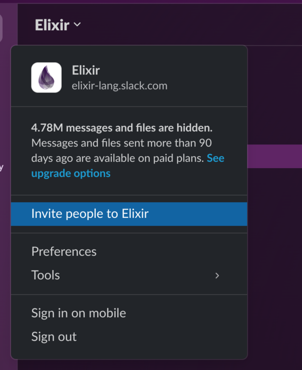
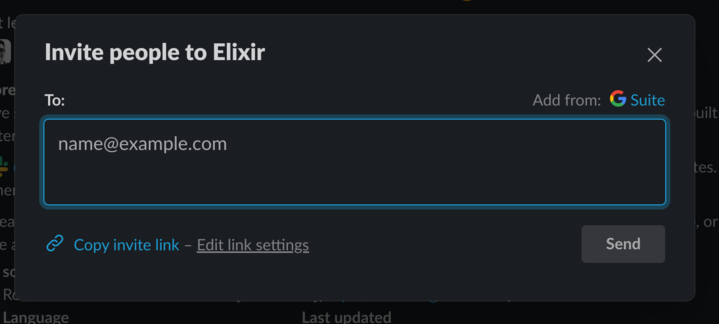
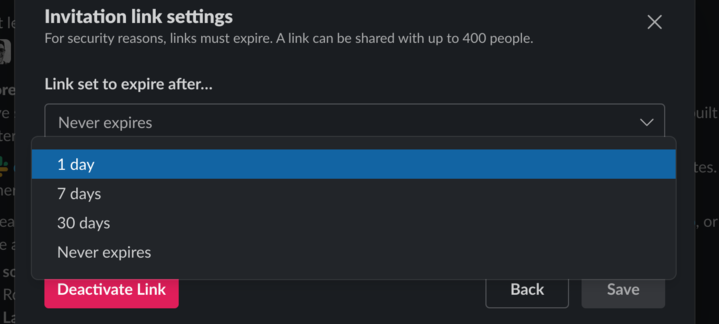

# ElixirSlack

Round-robin invites to the official [Elixir Slack](https://elixir-lang.slack.com).

## Contributing

Add a new invite token with the following steps:

1. Click on "Invite People" in the Elixir dropdown menu:

   

2. Click on "Edit link settings" to change the link expiration date:

   

3. Select "Never expires" from the expiration select menu:

   

4. Click "Copy invite link", paste it somewhere, and note the token at the end of the URL.

5. Add the token to the `tokens` map in `runtime.exs` along with the current date:

   ```elixir
   tokens = %{
     "zt-216sp1w4g-MHgJlFeJKTBCzPejZj7_tw" => "2024-01-24",
     ...,
     "YOUR NEW TOKEN HERE" => "DATE HERE"
   }
   ```

## Usage

Build and run the app locally:

```bash
MIX_ENV=prod mix do deps.get, release

_build/prod/rel/elixir_slack/bin/elixir_slack start
```

Run the app within the docker container locally:

```bash
docker build -t elixir_slack .
docker run --env PORT=8000 -p 8000:8000 elixir_slack
```

Or, deploy to fly by changing the name in `fly.toml` and then run:

```bash
fly launch
```

# License

MIT. See the [License](LICENSE.txt)
